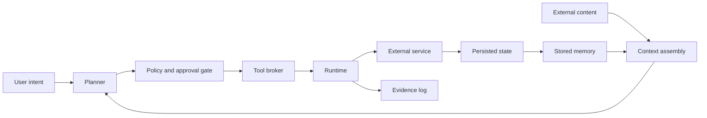

# System model and trust boundaries

The atlas uses a small reference model so that threat records can describe where authority changes hands.

## Components

### User intent

The requested outcome, constraints, and explicit approvals. This is the primary source of task authority.

### Context assembly

The point where instructions, retrieved material, files, prior messages, memory, and tool results are combined. This is often where data and control begin to blur.

### Planner

The component that selects or generates intermediate steps. It may be a model, fixed workflow, or combination of both.

### Policy and approval gate

The component that decides whether a proposed action is permitted. A gate can be deterministic, model-assisted, human-reviewed, or layered.

### Tool broker

The interface that exposes operations to the planner. It should define tool identity, required scope, argument rules, side effects, and expected evidence.

### Runtime

The process, container, browser, shell, or service account that performs an operation. Runtime isolation determines the practical blast radius of a bad decision.

### External service

Any system outside the immediate reasoning loop, such as mail, source control, storage, calendars, databases, payment systems, or infrastructure control planes.

### Stored memory and persisted state

Information retained after the current step or session. It includes long-term memory, task summaries, cached tool output, files, database records, and changed external state.

### Evidence log

A trace that records what was requested, proposed, authorized, executed, returned, and retained. Logs should distinguish model text from verified system events.

## Trust boundaries

| Boundary | Security question |
|---|---|
| external content to context | Can untrusted material become an instruction? |
| context to planner | Is source and authority preserved during reasoning? |
| planner to policy gate | Is the proposed action tied to the user's actual intent? |
| policy gate to tool broker | Are scope and arguments checked before execution? |
| tool broker to runtime | Does the runtime have more privilege than the action needs? |
| runtime to external service | Is the external effect authenticated, bounded, and reversible? |
| external result to memory | Can unverified output influence future work? |
| execution to evidence log | Can the trace prove what actually happened? |

## Security invariants

The initial research baseline uses six invariants:

1. Untrusted content cannot directly authorize an external effect.
2. Every external effect is linked to a user intent and an acting identity.
3. A delegated step cannot gain broader scope without a new approval.
4. Persistent memory records source, owner, creation time, and expiry.
5. High-impact actions produce tamper-evident evidence.
6. Revocation and containment remain possible during execution.

These invariants are design targets. Individual threat records document where they can fail and how that failure may be observed.